# 【UEFI】Windows下调试UEFI程序

 > Author: Sam Diao
 > Date: 2024-09-24
 > Rev

本文的调试代码均以C:\\UEFIWorkspace\\edk2\\MdeModulePkg\\Application\\HelloWorld\\为例

## 1. Windows下的调试方法

---------------

### 1.1 使用Visual Studio 2019进行调试

> 主逻辑：
>
> 1. 在VS2019中新建Makefile工程
> 2. 设置工程文件的目标路径
> 3. 修改工程文件的配置参数
> 4. 添加需要调试的代码
> 5. 编译代码并调试

#### 1.1.1 新建Makefile工程

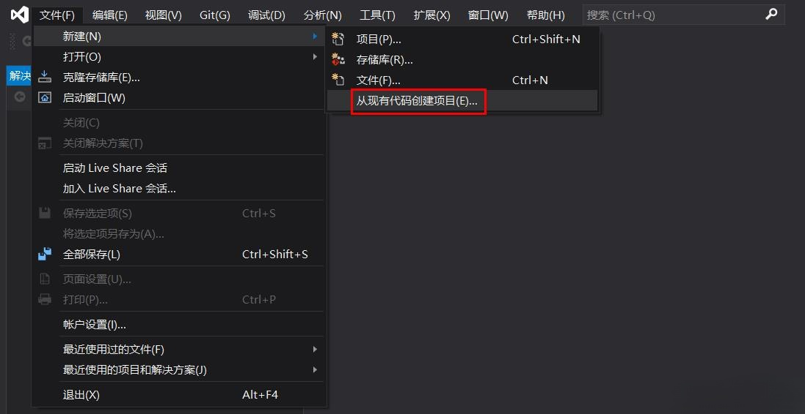

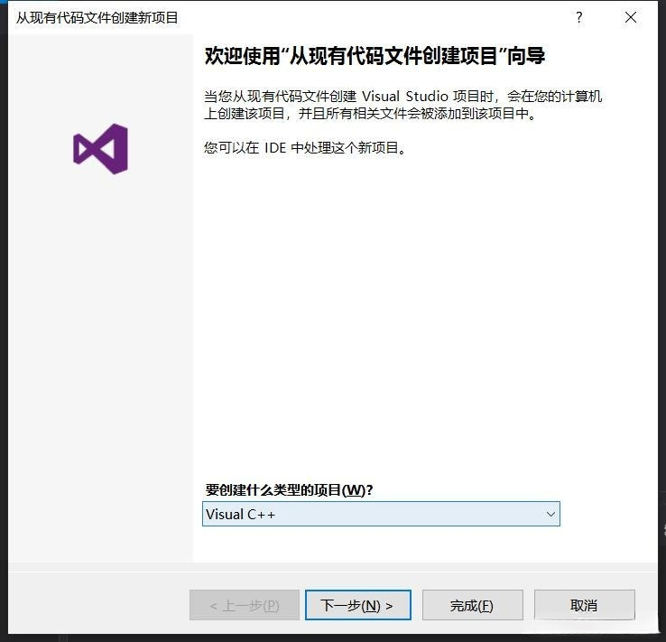

#### 1.1.2 设置目标路径

我放在C:\\UEFIWorkspace\\edk2\\MdeModulePkg\\Application\\HelloWorld\\下

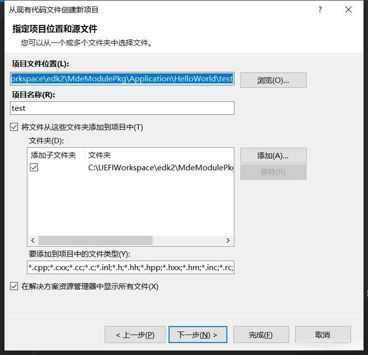

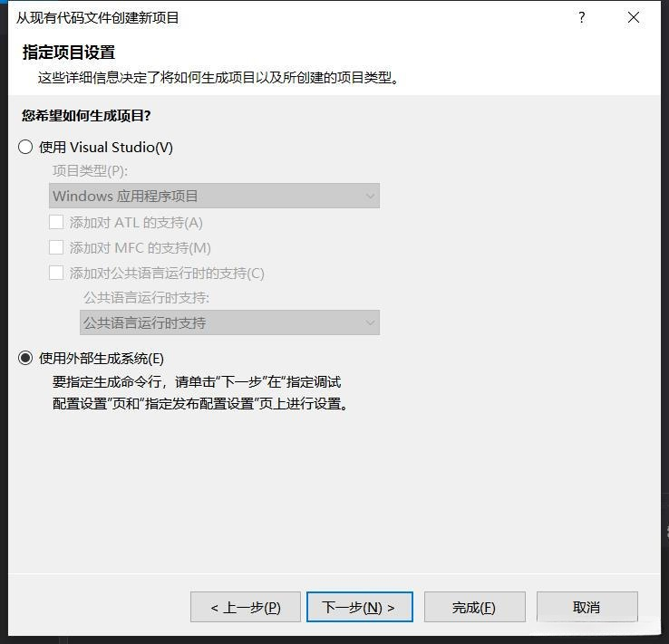

下方的needtomodfiy是在1.3节里会被修改的，可以直接理解成占位符。

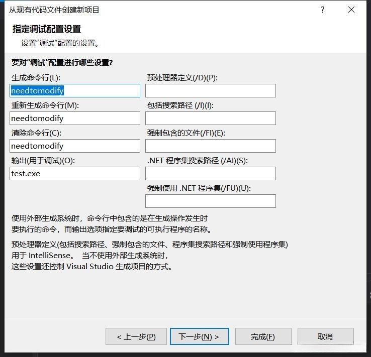

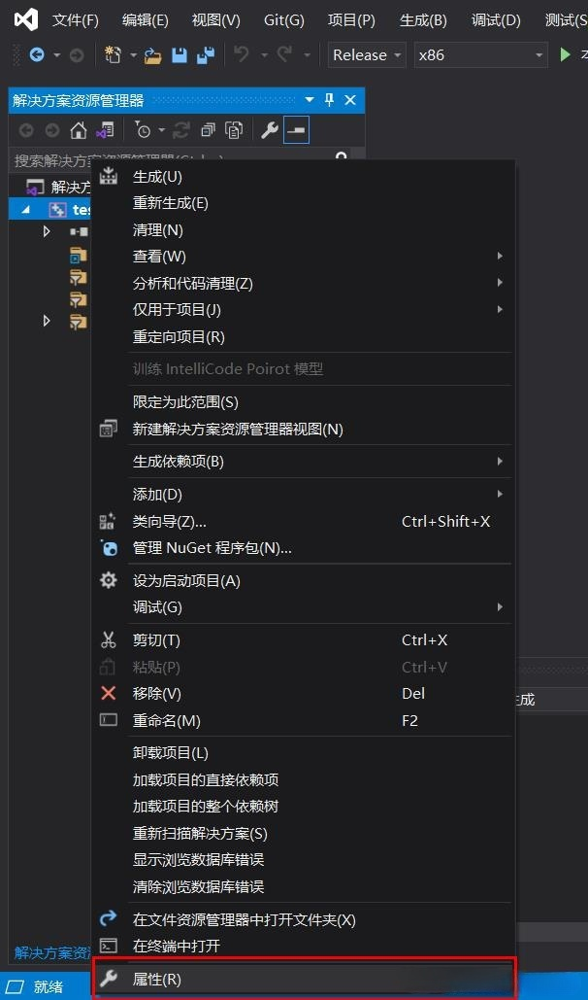

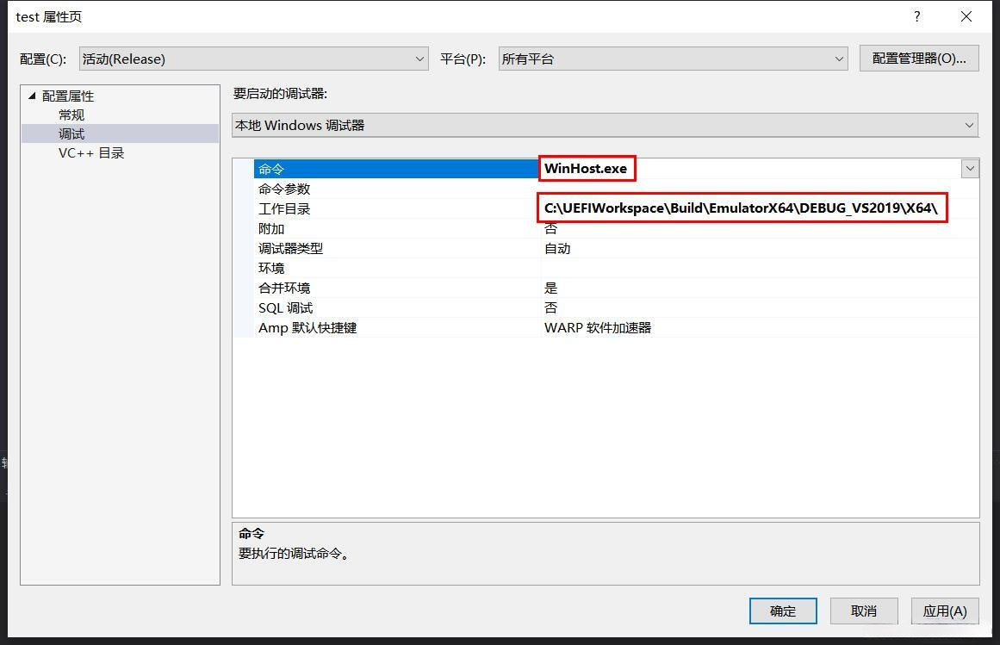

注：上方的工作目录需要格外注意两点：第一，尽量使用绝对路径；第二，地址后的'\\'不能省略。

#### 1.1.3 修改工程文件

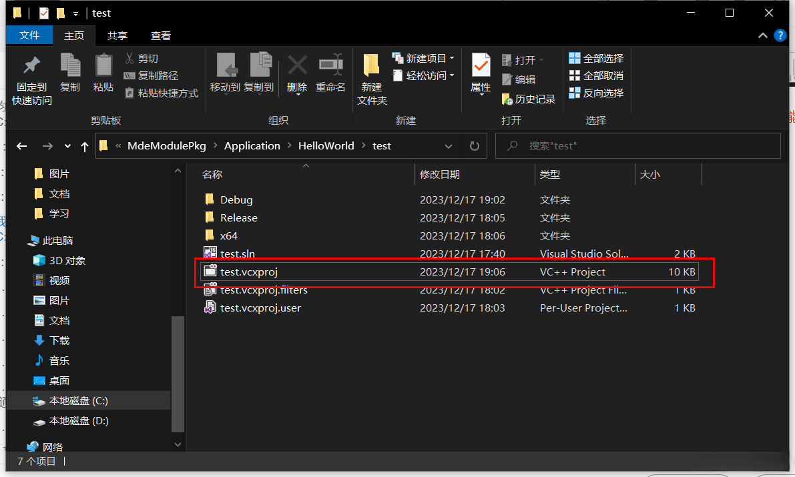

找到Win32和X64下的NMakeBuildCommandLine、NMakeCleanCommandLine和NMakeReBuildCommandLine，把needtomodify部分按照如下修改：

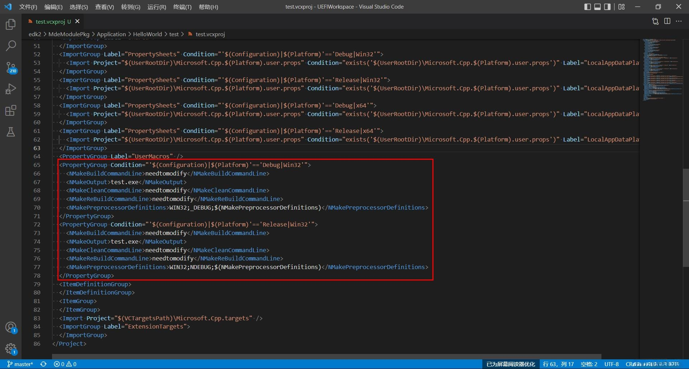

``` shell
   <PropertyGroup Condition="'$(Configuration)|$(Platform)'=='Debug|Win32'">

     <NMakeBuildCommandLine>

       cd /D C:\\UEFIWorkspace

       set WORKSPACE=C:\\UEFIWorkspace

       call mybuild.bat

       call edk2\\edksetup.bat

       call build.bat -p edk2\\MdeModulePkg\\MdeModulePkg.dsc -m edk2\\MdeModulePkg\\Application\\HelloWorld\\HelloWorld.inf -t VS2019 -a IA32 -b DEBUG

     </NMakeBuildCommandLine>

     <NMakeOutput>test.exe</NMakeOutput>

     <NMakeCleanCommandLine>

       cd /D C:\\UEFIWorkspace

       set WORKSPACE=C:\\UEFIWorkspace

       call mybuild.bat

       call edk2\\edksetup.bat

       call build.bat -p edk2\\MdeModulePkg\\MdeModulePkg.dsc -m edk2\\MdeModulePkg\\Application\\HelloWorld\\HelloWorld.inf -t VS2019 -a IA32 -b DEBUG clean

     </NMakeCleanCommandLine>

     <NMakeReBuildCommandLine>

       cd /D C:\\UEFIWorkspace

       set WORKSPACE=C:\\UEFIWorkspace

       call mybuild.bat

       call edk2\\edksetup.bat

       call build.bat -p edk2\\MdeModulePkg\\MdeModulePkg.dsc -m edk2\\MdeModulePkg\\Application\\HelloWorld\\HelloWorld.inf -t VS2019 -a IA32 -b DEBUG clean

       call build.bat -p edk2\\MdeModulePkg\\MdeModulePkg.dsc -m edk2\\MdeModulePkg\\Application\\HelloWorld\\HelloWorld.inf -t VS2019 -a IA32 -b DEBUG

     </NMakeReBuildCommandLine>

     <NMakePreprocessorDefinitions>WIN32;\_DEBUG;$(NMakePreprocessorDefinitions)</NMakePreprocessorDefinitions>

   </PropertyGroup>

   <PropertyGroup Condition="'$(Configuration)|$(Platform)'=='Release|Win32'">

     <NMakeBuildCommandLine>

       cd /D C:\\UEFIWorkspace

       set WORKSPACE=C:\\UEFIWorkspace

       call mybuild.bat

       call edk2\\edksetup.bat

       call build.bat -p edk2\\MdeModulePkg\\MdeModulePkg.dsc -m edk2\\MdeModulePkg\\Application\\HelloWorld\\HelloWorld.inf -t VS2019 -a IA32 -b RELEASE

     </NMakeBuildCommandLine>

     <NMakeOutput>test.exe</NMakeOutput>

     <NMakeCleanCommandLine>

       cd /D C:\\UEFIWorkspace

       set WORKSPACE=C:\\UEFIWorkspace

       call mybuild.bat

       call edk2\\edksetup.bat

       call build.bat -p edk2\\MdeModulePkg\\MdeModulePkg.dsc -m edk2\\MdeModulePkg\\Application\\HelloWorld\\HelloWorld.inf -t VS2019 -a IA32 -b RELEASE clean

     </NMakeCleanCommandLine>

     <NMakeReBuildCommandLine>

       cd /D C:\\UEFIWorkspace

       set WORKSPACE=C:\\UEFIWorkspace

       call mybuild.bat

       call edk2\\edksetup.bat

       call build.bat -p edk2\\MdeModulePkg\\MdeModulePkg.dsc -m edk2\\MdeModulePkg\\Application\\HelloWorld\\HelloWorld.inf -t VS2019 -a IA32 -b RELEASE clean

       call build.bat -p edk2\\MdeModulePkg\\MdeModulePkg.dsc -m edk2\\MdeModulePkg\\Application\\HelloWorld\\HelloWorld.inf -t VS2019 -a IA32 -b RELEASE

     </NMakeReBuildCommandLine>

     <NMakePreprocessorDefinitions>WIN32;NDEBUG;$(NMakePreprocessorDefinitions)</NMakePreprocessorDefinitions>

   </PropertyGroup>

   <PropertyGroup Condition="'$(Configuration)|$(Platform)'=='Debug|X64'">

     <NMakeBuildCommandLine>

       cd /D C:\\UEFIWorkspace

       set WORKSPACE=C:\\UEFIWorkspace

       call mybuild.bat

       call edk2\\edksetup.bat

       call build.bat -p edk2\\MdeModulePkg\\MdeModulePkg.dsc -m edk2\\MdeModulePkg\\Application\\HelloWorld\\HelloWorld.inf -t VS2019 -a X64 -b DEBUG

     </NMakeBuildCommandLine>

     <NMakeOutput>test.exe</NMakeOutput>

     <NMakeCleanCommandLine>

       cd /D C:\\UEFIWorkspace

       set WORKSPACE=C:\\UEFIWorkspace

       call mybuild.bat

       call edk2\\edksetup.bat

       call build.bat -p edk2\\MdeModulePkg\\MdeModulePkg.dsc -m edk2\\MdeModulePkg\\Application\\HelloWorld\\HelloWorld.inf -t VS2019 -a X64 -b DEBUG clean

     </NMakeCleanCommandLine>

     <NMakeReBuildCommandLine>

       cd /D C:\\UEFIWorkspace

       set WORKSPACE=C:\\UEFIWorkspace

       call mybuild.bat

       call edk2\\edksetup.bat

       call build.bat -p edk2\\MdeModulePkg\\MdeModulePkg.dsc -m edk2\\MdeModulePkg\\Application\\HelloWorld\\HelloWorld.inf -t VS2019 -a X64 -b DEBUG clean

       call build.bat -p edk2\\MdeModulePkg\\MdeModulePkg.dsc -m edk2\\MdeModulePkg\\Application\\HelloWorld\\HelloWorld.inf -t VS2019 -a X64 -b DEBUG

     </NMakeReBuildCommandLine>

     <NMakePreprocessorDefinitions>X64;\_DEBUG;$(NMakePreprocessorDefinitions)</NMakePreprocessorDefinitions>

   </PropertyGroup>

   <PropertyGroup Condition="'$(Configuration)|$(Platform)'=='Release|X64'">

     <NMakeBuildCommandLine>

       cd /D C:\\UEFIWorkspace

       set WORKSPACE=C:\\UEFIWorkspace

       call mybuild.bat

       call edk2\\edksetup.bat

       call build.bat -p edk2\\MdeModulePkg\\MdeModulePkg.dsc -m edk2\\MdeModulePkg\\Application\\HelloWorld\\HelloWorld.inf -t VS2019 -a X64 -b RELEASE

     </NMakeBuildCommandLine>

     <NMakeOutput>test.exe</NMakeOutput>

     <NMakeCleanCommandLine>

       cd /D C:\\UEFIWorkspace

       set WORKSPACE=C:\\UEFIWorkspace

       call mybuild.bat

       call edk2\\edksetup.bat

       call build.bat -p edk2\\MdeModulePkg\\MdeModulePkg.dsc -m edk2\\MdeModulePkg\\Application\\HelloWorld\\HelloWorld.inf -t VS2019 -a X64 -b RELEASE clean

     </NMakeCleanCommandLine>

     <NMakeReBuildCommandLine>

       cd /D C:\\UEFIWorkspace

       set WORKSPACE=C:\\UEFIWorkspace

       call mybuild.bat

       call edk2\\edksetup.bat

       call build.bat -p edk2\\MdeModulePkg\\MdeModulePkg.dsc -m edk2\\MdeModulePkg\\Application\\HelloWorld\\HelloWorld.inf -t VS2019 -a X64 -b RELEASE clean

       call build.bat -p edk2\\MdeModulePkg\\MdeModulePkg.dsc -m edk2\\MdeModulePkg\\Application\\HelloWorld\\HelloWorld.inf -t VS2019 -a X64 -b RELEASE

     </NMakeReBuildCommandLine>

     <NMakePreprocessorDefinitions>X64;NDEBUG;$(NMakePreprocessorDefinitions)</NMakePreprocessorDefinitions>

   </PropertyGroup>
```

#### 1.1.4 添加代码

添加HelloWorld.c到Source下

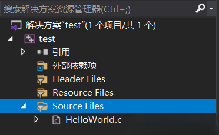

#### 1.1.5 编译代码并调试

在代码处增加一处断点用于调试

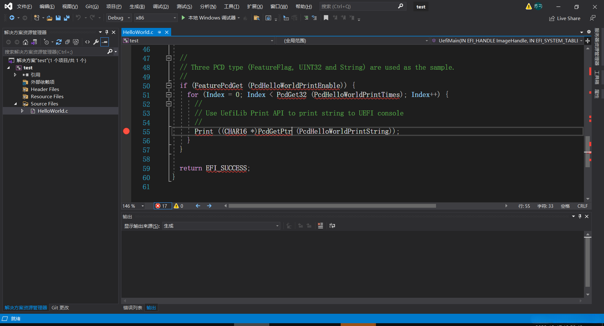

F5开始编译并调试，过程中注意观察log

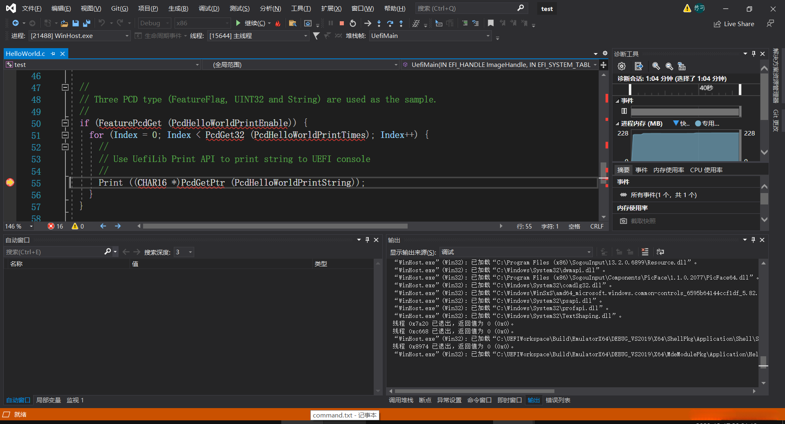

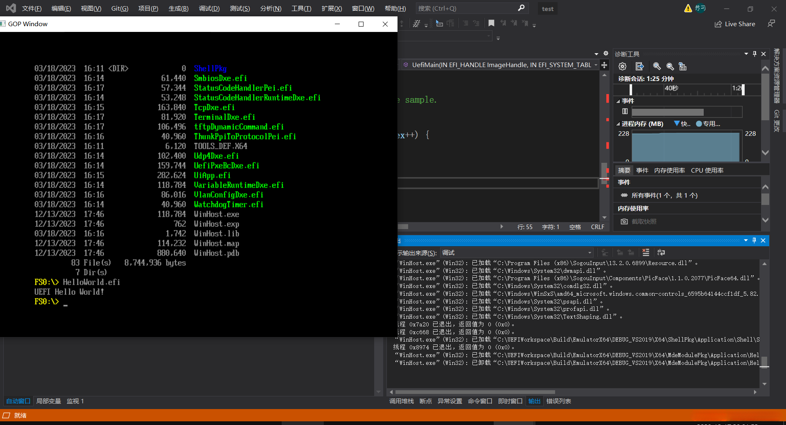

### 1.2 使用WINDBG进行调试

> 主逻辑：
>
> 1. 安装WINDBG、QEMU、Intel UDK Debugger Tool、OSFMount、UltralSO
> 2. 创建QEMU虚拟硬盘
> 3. 编译OVMF镜像文件和HelloWorld.efi
> 4. 调试

#### 1.2.1 安装必要工具

##### 1.2.1.1 WINDBG

我使用的WINDBG版本是6.12.0002.633，这个部分在最开始就装好，因为后续在安装Intel UDK Debugger Tool的时候会检测WINDBG是否存在，否则会无法安装。

##### 1.2.1.2 QEMU

我使用的QEMU版本是0.13.0，记得要把QEMU的实际安装地址编写进环境变量里。


##### 1.2.1.3 Intel UDK Debugger Tool

Install地址不要修改，保持默认！


设置Channel的时候要宣称Pipe，Port自定义为QemuPipeDbg。

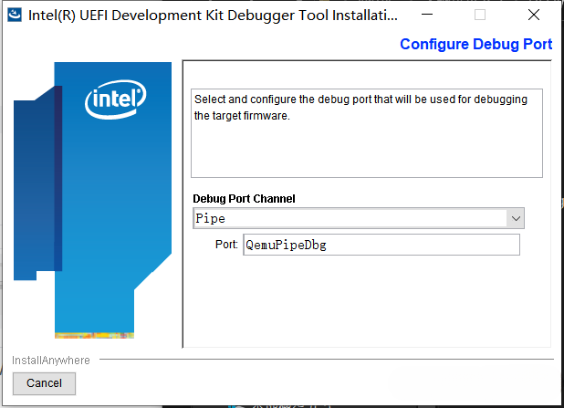

##### 1.2.1.4 OSFMount、UltralSO

我使用的OSFMount版本是3.1

我使用的UltralSO版本是9.7.6.3829

#### 1.2.2 创建QEMU虚拟硬盘

##### 1.2.2.1 打开UltralSO创建硬盘镜像

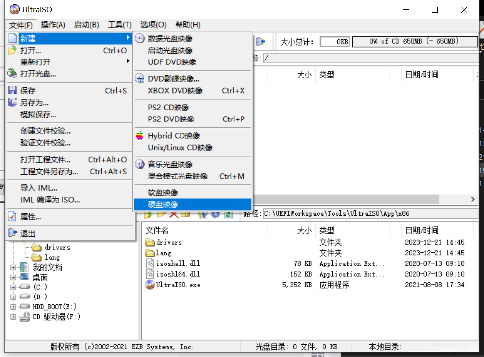

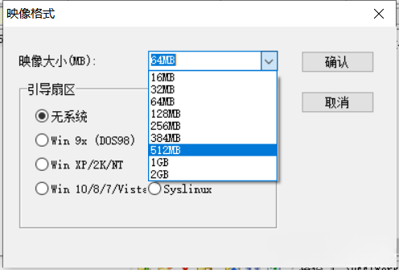

镜像大小根据自己的需要设定，我选择设定为512MB，然后将镜像另存为HDD\_BOOT.IMA

##### 1.2.2.2 打开OSFMount挂载虚拟硬盘并导入调试程序


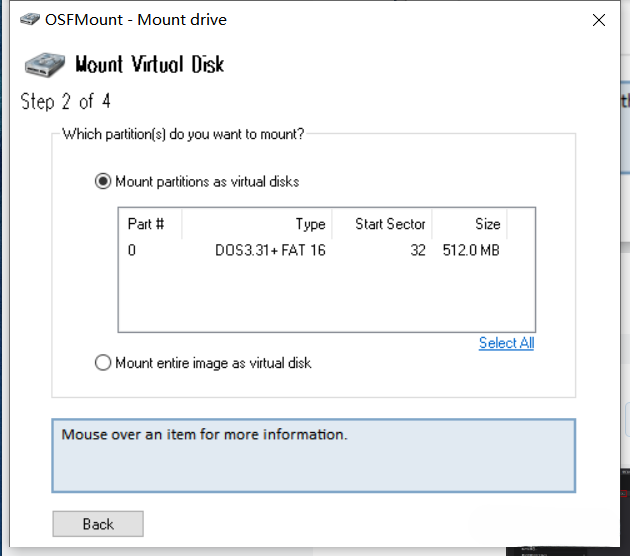

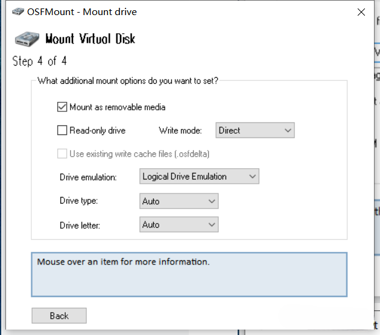

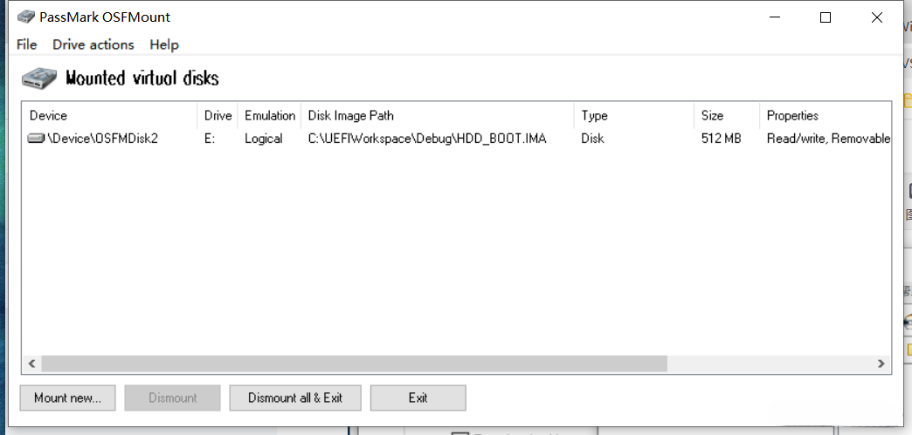

挂载完毕如上，此时在我的电脑下会出现一个新的硬盘，盘符为HDD\_BOOT。

#### 1.2.3 编译OVMF镜像文件和HelloWorld.efi(使用x86/64 Native Tools Command Prompt for VS2019)

##### 1.2.3.1 编译OVMF镜像文件

基于OVMF镜像镜像源码级调试，编译edk2\\OvmfPkg。

32位：

```shell
C:\\UEFIWorkspace>build -p edk2\\OvmfPkg\\OvmfPkgIA32.dsc -t VS2019 -a IA32 -b NOOPT -D SOURCE\_DEBUG\_ENABLE
```

64位：

```shell
C:\\UEFIWorkspace>build -p edk2\\OvmfPkg\\OvmfPkgX64.dsc -t VS2019 -a X64 -b NOOPT -D SOURCE\_DEBUG\_ENABLE
```

##### 1.2.3.2 编译HelloWorld.efi

32位：

```shell
C:\\UEFIWorkspace>build -p edk2\\MdeModulePkg\\MdeModulePkg.dsc -m edk2\\MdeModulePkg\\Application\\HelloWorld\\HelloWorld.inf -t VS2019 -a IA32
```

64位：

```shell
C:\\UEFIWorkspace>build -p edk2\\MdeModulePkg\\MdeModulePkg.dsc -m edk2\\MdeModulePkg\\Application\\HelloWorld\\HelloWorld.inf -t VS2019 -a X64
```

#### 1.2.4 调试

##### 1.2.4.1 文件准备

在UEFIWorkspace下新建一个文件夹并命名为QemuDebug。

将32位或者64位的OVMF.fd复制到QemuDebug文件夹下。

将32位或者64位的HelloWorld.efi复制到HDD\_BOOT的盘符下，然后将HDD\_BOOT.IMA复制到QemuDebug文件夹下，想偷懒的话可以直接将HDD\_BOOT.IMA在1.2.2.1节中的另存为默认地址放置在QemuDebug文件夹下，这样就不需要再手动的搬移HDD\_BOOT.IMA，做完这一步以后，把HDD\_BOOT弹出，否则会在下面正式调试的时候报错。

从QEMU的根目录下复制qemu-x86\_64.bat到QemuDebug文件夹下，并修改这个批处理文件如下：


即，注释掉最后一行，并添加新的命令，其中QemuPipeDbg要与1.2.1.3节中设置Pipe Port名称match：

```shell
C:\\UEFIWorkspace\\Tools\\QEMU\\qemu-system-x86\_64.exe -bios OVMF.fd -usbdevice disk:HDD\_BOOT.IMA -serial pipe:QemuPipeDbg
```

至此，文件准备完毕，QemuDebug文件夹下将会存在以下三个文件：


##### 1.2.4.2 开始调试

运行Start WinDbg with Intel UDK Debugger Tool，UDK Debugger和WINDBG会一起弹出，如下：

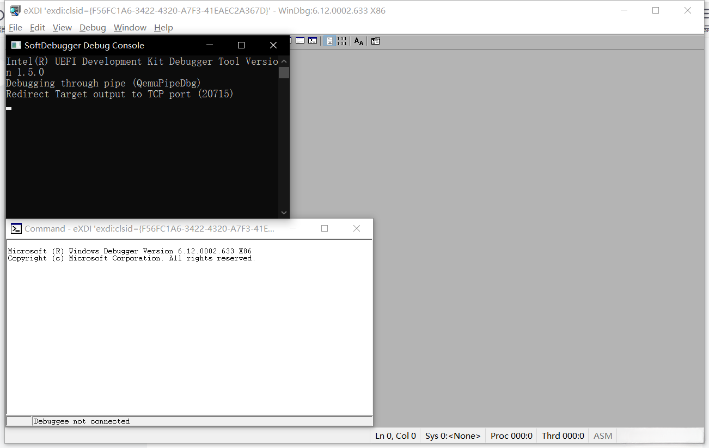

打开CMD，cd到C:\\UEFIWorkspace\\QemuDebug\\下，并运行qemu-x86\_64.bat：


此时，QEMU的窗口已经弹出，WINDBG也会很快connected并进入第一个断点，此时在command bar中输入g，用于继续运行，等待QEMU进入UEFI SHELL：

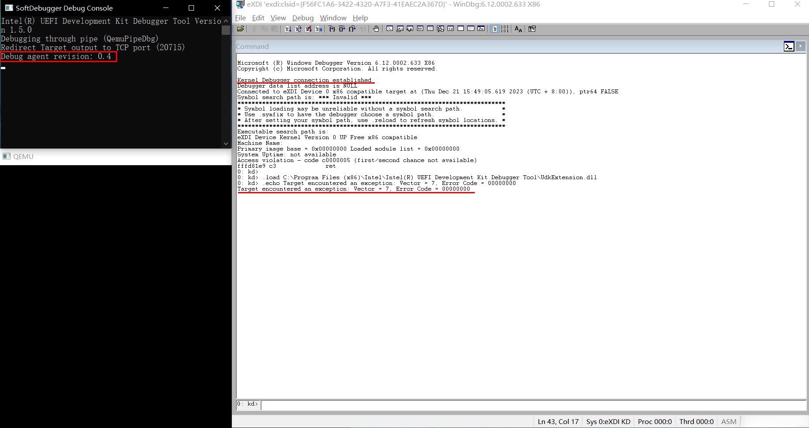

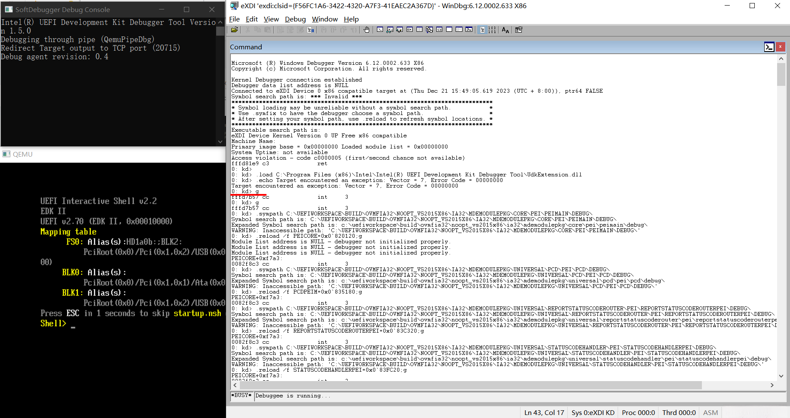

为了要对HelloWorld.efi进行源码级调试，此时需要在WINDBG中暂时中断连接，并在command bar中输入bu helloworld，然后输入g继续连接：


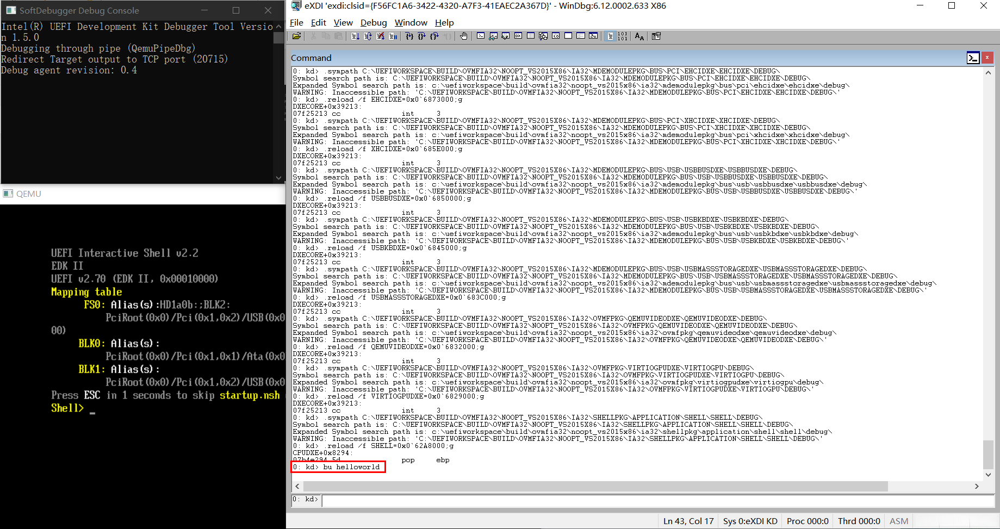


在UEFI SHELL下定位到FS0:，运行HelloWorld.efi

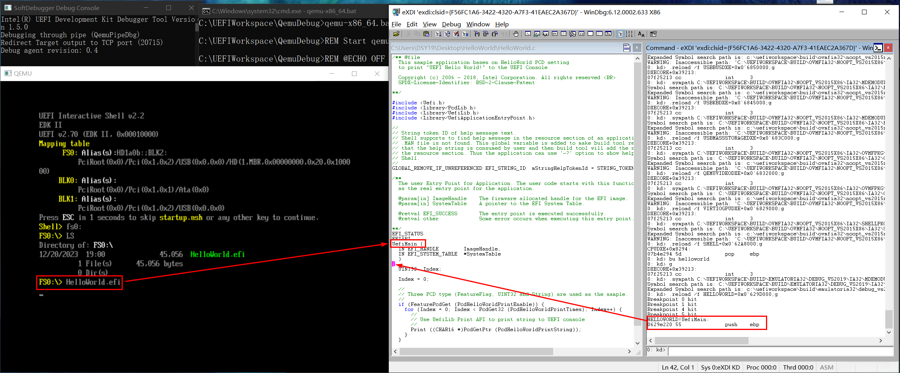

此时可以看到，efi的源代码自己跳出了，并且断点在函数的第一行，此时输入g，继续运行


 至此，整个WINDBG的通道就已经建立了，根据不同的函数自行调试即可。
